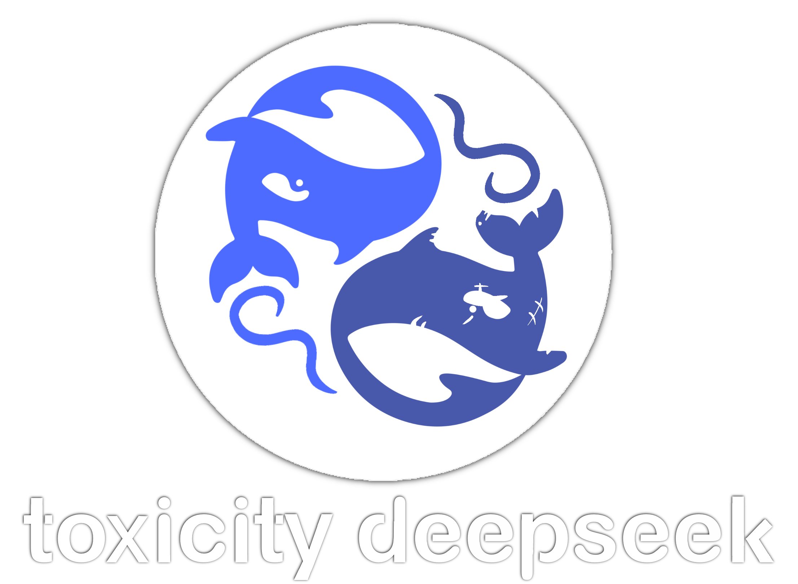

    

  <h1 style="margin-bottom: 0.2em;">Toxicity DeepSeek</h1>
  

    Toxicity generation analysis on DeepSeek API and DeepSeek-R1-Distill-Qwen-1.5B
  

  

    <a href="https://github.com/SalvatoreDL01" target="_blank">Salvatore Michele De Luca</a>
  

# Toxicity DeepSeek

## Abstract
This study builds on the work done in: [RealToxicityPrompts: Evaluating Neural
Toxic Degeneration in Language Models Gehman et al., 2020](https://toxicdegeneration.allenai.org/), and specifically, relies on the REALTOXICITYPROMPTS database to generate the
text from the DeepSeek-R1-Distill-Qwen-1.5B and DeepSeek-API models. This was then
evaluated using the PERSPECTIVE API and compared with the results generated by the
GPT-1 and GPT-2 models.
Two purification strategies were then performed on the DeepSeek-R1-Distill-Qwen-1.5B model to evaluate their influence. The first, Bad Words, consists of selecting
a list of tokens that we force the model not to generate. The second strategy
implemented is Domain-Adaptive Pretraining (DAPT), in which we train the model with a set of specifically selected sentences before generating
the prompts. Specifically, two sets of continuations were constructed from
REALTOXICITYPROMPTS, one containing only continuations with toxicity greater
than 0.5 and the other with toxicity less than 0.5.
The results showed that the DAPT strategy is highly influential in managing
toxicity and that the models follow the natural tendency to generate few sentences
with highly toxic content and many with low toxicity.

## Installing
Run the commands provided in order to set up your environment:
1. `git clone https://github.com/SalvatoreDL01/Toxicity_DeepSeek.git`
1. `cd Toxicity_DeepSeek`
2. Install [Anaconda](https://docs.anaconda.com/anaconda/install/), then run `conda env create -f environment.yml` to create a new Anaconda environment named `Toxicity_DeepSeek` 
with all necessary dependencies.
4. Run `conda activate Toxicity_DeepSeek` before running any further scripts or notebooks.
5. The following code must be run in __Toxicity_DeepSeek__.

## Getting Started
To get a surface level understanding of this project, you can check the Configurations.py file. Here you will have
access to all the changeable variables and their description. To keep it short, you can select, add or remove the models
you may use, change the directories and add your API keys. When going over each section, we will go over any parameter
you might want to change. If you just want to test this code with you can leave the parameter that were used in my
analysis and just run the following lines.
### Getting the data
We used [Real Toxicity Prompts](https://huggingface.co/datasets/allenai/real-toxicity-prompts). This database was split in four
ranges of toxicity ([0-0.25, 0.25-0.5, 0.5-0.75, 0.75-1.0]). If you want to change the DB or how it gets split you must adjust
__labels, bins and DATABASE_URI__ in the configuration.

To download the DataBase and split it in run the following line:
 `generate_prompts` 
This code also makes the toxic and not_toxic DBs used in DAPT training.

### Getting API access
We used the following two APIs to run our experiments:
1. [Perspective API](https://github.com/conversationai/perspectiveapi/tree/master/1-get-started) to score text for toxicity;
2. [DeepSeek API](https://platform.deepseek.com/) to generate text with the DeepSeek chatbot.

Remember to update __PERSPECTIVE_API_KEY__ and __DEEPSEEK_API_KEY__ in the Configuration file.

### Reproducing the experiments
First, we generate the continuations for the selected prompts. Adjust __mapped_models__ and __bad_word_mapped_model__ if needed.
Then run:
 `continuation_generation` 
Then we can generate the continuation with DeepSeek chatbot. Remember to add your __DEEPSEEK_API_KEY__.
Run:
 `DeepSeek_connection` 
For the __DAPT (Domain-Adaptive Pretraining)__ you can change __TRAIN_MODEL_NAME__ and __TRAIN_MODEL_PATH__ in the configuration and run:
 `train_and_generate` 
1. If you want to train the models without generating the prompts you can run:  `train_model` 
2. If you have already trained a model add it to __mapped_trained_models__ and then run:  `generate_dapt` 

Finally, to evaluate the toxicity of the generated continuation adjust __model_dirs__ to contain only the directories of
the results you want to evaluate. Remember to add your __PERSPECTIVE_API_KEY__. Run:
 `perspective_api` 
This script is adapted on the base one request per-second.

Script producing graphics will be soon available.
